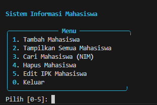
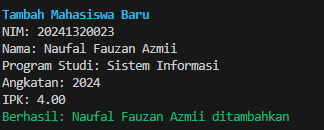

# Sistem Informasi Mahasiswa

Program sederhana untuk mengelola data mahasiswa menggunakan Python melalui terminal.

## Identitas

- **Nama:** Naufal Fauzan Azmii
- **NPM:** 20241320023
- **Program Studi:** Sistem Informasi
- **Mata Kuliah:** Pemrograman Python

## Deskripsi

Sistem Informasi Mahasiswa merupakan program berbasis Python yang digunakan untuk mengelola data mahasiswa secara sederhana melalui terminal.

Program menyediakan fitur untuk:

- Menambahkan data mahasiswa
- Menampilkan seluruh data mahasiswa
- Mencari mahasiswa berdasarkan NIM
- Menghapus data mahasiswa
- Mengubah IPK mahasiswa
- Melakukan validasi data mahasiswa

## Fitur

Program memiliki beberapa fitur utama:

1. **Tambah Mahasiswa**
2. **Tampilkan Semua Mahasiswa**
3. **Cari Mahasiswa berdasarkan NIM**
4. **Hapus Mahasiswa**
5. **Edit IPK Mahasiswa**

Program juga memiliki validasi:

- NIM minimal 6 karakter
- Nama tidak boleh kosong
- IPK harus berada pada rentang 0 sampai 4
- NIM tidak boleh duplikat

## Requirements

Program membutuhkan:

- Python 3.10 atau lebih baru
- pip
- Virtual Environment

Package Python yang digunakan:

- `requests`
- `rich`
- `pytest`
- `black`
- `ruff`

## Instalasi

### 1. Clone Repository

```bash
git clone https://github.com/naufal9393/Latihanpemogrman.py.git
cd Latihanpemogrman.py
```

### 2. Membuat Virtual Environment

Windows PowerShell:

```powershell
python -m venv venv
```

Aktifkan virtual environment:

```powershell
venv\Scripts\Activate.ps1
```

### 3. Install Dependencies

```powershell
python -m pip install --upgrade pip
pip install -r requirements.txt
```

## Menjalankan Program

Jalankan program dengan:

```powershell
python -m src.main
```

Program akan menampilkan menu:

```text
Sistem Informasi Mahasiswa

╭────────────── Menu ──────────────╮
│ 1. Tambah Mahasiswa
│ 2. Tampilkan Semua Mahasiswa
│ 3. Cari Mahasiswa (NIM)
│ 4. Hapus Mahasiswa
│ 5. Edit IPK Mahasiswa
│ 0. Keluar
╰─────────────────────────────────╯
```

## Contoh Data Mahasiswa

| NIM | Nama | Program Studi | Angkatan | IPK |
|---|---|---|---:|---:|
| 20241320021 | Rafi Haikal Akram | Sistem Informasi | 2024 | 3.50 |
| 20241320023 | Naufal Fauzan Azmii | Sistem Informasi | 2024 | 4.00 |
| 20241320042 | Muhammad Khoirul Amad | Teknik Komputer | 2024 | 3.90 |
| 20241320049 | Athallah Naufal Ghali | Teknik Komputer | 2024 | 3.33 |

## Testing

Pengujian dilakukan menggunakan `pytest`.

Untuk menjalankan seluruh pengujian:

```powershell
python -m pytest
```

Project memiliki 12 pengujian yang mencakup:

- Data mahasiswa valid
- NIM terlalu pendek
- IPK tidak valid
- Tambah dan cari mahasiswa
- NIM duplikat
- NIM kosong
- Nama kosong
- IPK batas bawah 0.00
- IPK batas atas 4.00
- Hapus NIM yang tidak ditemukan
- Cari NIM yang tidak ditemukan
- Nama sangat panjang

Hasil pengujian:

```text
12 passed
```

## Dokumentasi

### Menu Utama



### Daftar Mahasiswa



## Struktur Project

```text
Latihanpemogrman.py/
├── src/
│   ├── __init__.py
│   ├── main.py
│   └── models.py
├── tests/
│   ├── __init__.py
│   └── test_main.py
├── docs/
│   ├── menu-utama.png
│   └── daftar-mahasiswa.png
├── requirements.txt
├── .gitignore
└── README.md
```

## Teknologi

Project ini menggunakan:

- Python
- Rich
- Pytest
- Requests
- Black
- Ruff
- Git
- GitHub

## Validasi Data

### Validasi NIM

NIM harus memiliki minimal 6 karakter.

### Validasi Nama

Nama mahasiswa tidak boleh kosong.

### Validasi IPK

IPK harus berada pada rentang 0.00 sampai 4.00.

### Validasi NIM Duplikat

Satu NIM tidak dapat digunakan oleh lebih dari satu mahasiswa.

## Checklist

- [x] Python 3.10 atau lebih baru
- [x] Virtual environment dibuat
- [x] Virtual environment digunakan
- [x] Dependencies terinstall
- [x] requirements.txt tersedia
- [x] .gitignore tersedia
- [x] Program dapat dijalankan
- [x] Unit testing berhasil
- [x] Git repository dibuat
- [x] GitHub repository terhubung
- [x] Project berhasil di-push ke GitHub
- [x] README tersedia
- [x] Dokumentasi screenshot tersedia
- [x] Minimal 3 commit bermakna

## Repository

Repository GitHub:

https://github.com/naufal9393/Latihanpemogrman.py